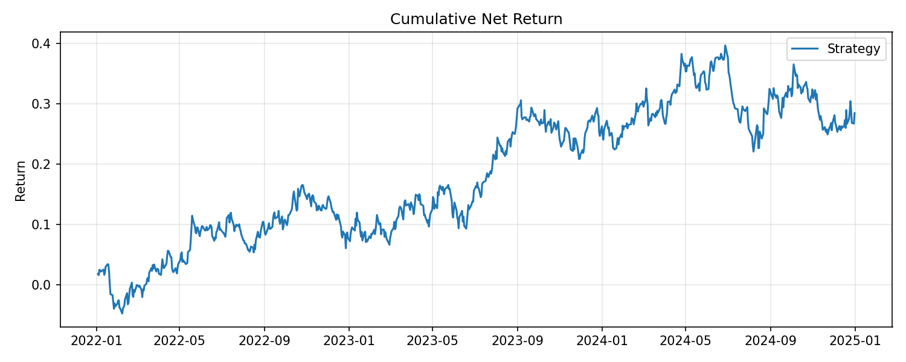
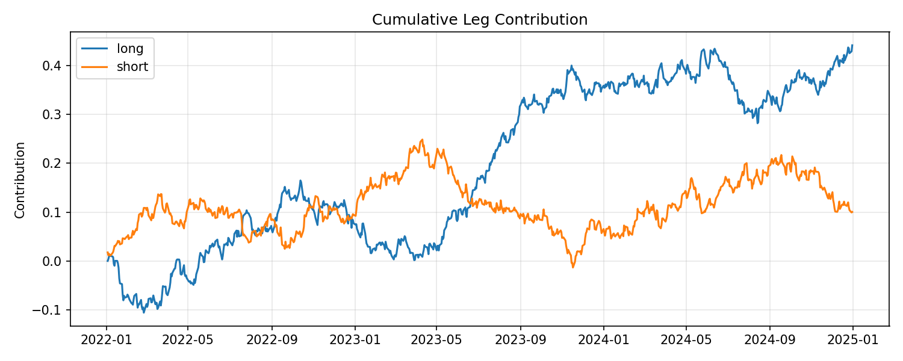

# Cross-Sectional Equity Alpha Research Platform


A portfolio-oriented equity alpha research workflow for U.S. stocks. Builds a daily cross-sectional panel, engineers leakage-safe features, produces out-of-sample predictions via walk-forward validation, constructs market-neutral long/short portfolios, and evaluates performance with realistic frictions.

## Contents

- Modular Python package under `src/alpha_research`
- Config-driven research runs via TOML
- Daily feature engineering with leakage-safe forward targets
- Baseline rank-composite and ridge regression models
- Sector-aware, beta-neutral portfolio construction
- Backtesting with transaction costs, drawdown tracking, and regime analysis
- Tests for leakage-sensitive pipeline components
- Synthetic offline config for smoke testing without market data downloads

## Results

### Equity Curve


### Long/Short Leg Contributions


## Quick Start

```bash
# 1. Install in editable mode with dev dependencies
python3 -m pip install -e ".[dev]"

# 2. Run the synthetic smoke pipeline (no network required)
alpha-research run --config configs/synthetic.toml

# 3. Run the full market-data workflow (requires network access)
alpha-research run --config configs/default.toml
```

Outputs are written to:

| Path | Contents |
|---|---|
| `data/cache/` | Cached raw and feature datasets |
| `outputs/` | Metrics tables, strategy returns CSVs |
| `outputs/figures/` | Equity curve and leg contribution plots |
| `docs/research_summary.md` | Generated research summary report |

## Research Workflow

The package exposes five main pipeline interfaces:

```python
from alpha_research import (
    build_dataset,
    generate_features,
    fit_predict,
    construct_portfolio,
    run_backtest,
)

panel        = build_dataset(config.data)
features     = generate_features(panel, config.features)
predictions  = fit_predict(features, config.split, config.model)
weights      = construct_portfolio(predictions, exposures, config.portfolio)
result       = run_backtest(weights, returns, config.backtest)
```

## Package Structure

```
src/alpha_research/
├── cli.py          CLI entry point (alpha-research run)
├── config.py       Dataclass configs loaded from TOML
├── data.py         Panel builder: synthetic and yfinance sources
├── features.py     Cross-sectional feature engineering
├── modeling.py     Walk-forward ridge and composite signal models
├── portfolio.py    Sector-neutral, beta-neutral portfolio construction
├── backtest.py     Return attribution, turnover, drawdown, regime metrics
└── reporting.py    Plot generation and research summary report
```

## Data Assumptions

The default free-data workflow uses `yfinance` with a liquid multi-sector U.S. universe (~55 large-cap tickers + SPY benchmark). This is appropriate for a research prototype; the generated report explicitly flags survivorship bias, metadata gaps, and free-data limitations.

For production use, replace `data.py` with a vendor feed and update `configs/default.toml` accordingly.

## Running Tests

```bash
pytest
```

## License

MIT — see [LICENSE](LICENSE).
